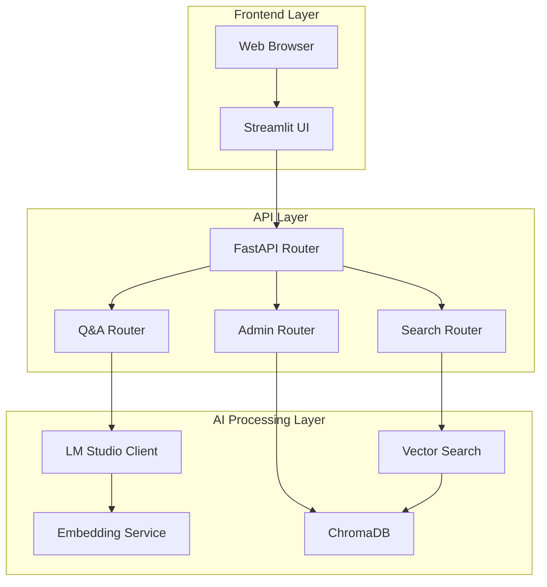

# Legal Tech Developer & Admin Documentation 🛠️⚙️

## Overview

This document contains technical implementation details, development workflows, administration guides, and sensitive configuration information for the DNOTI Legal Tech semantic search system. This is intended for developers, system administrators, and technical stakeholders.

> **⚠️ ADMIN ONLY**: This document contains sensitive technical details and should not be shared publicly.

## 🏗️ System Architecture

### Three-Layer Architecture



### Data Flow Architecture

1. **Document Ingestion Pipeline**
   ```
   Raw JSON → Preprocessor → Chunker → Embedding Generator → ChromaDB
   ```

2. **Search Query Pipeline**
   ```
   User Query → Query Processor → Embedding → Vector Search → Re-ranking → Results
   ```

3. **Q&A Pipeline**
   ```
   Question → Context Retrieval → LM Studio → Response Generation → Answer
   ```

## 🔧 Technical Implementation Details

### Core Components Deep Dive

#### LM Studio Client (`src/llm/lm_studio_client.py`)
```python
class LMStudioClient:
    """
    Production-ready LM Studio integration with:
    - Connection pooling and retry logic
    - Token counting and rate limiting  
    - Streaming response support
    - Error handling and fallback models
    """
    
    def __init__(self):
        self.base_url = "http://localhost:1234/v1"
        self.model_name = "deepseek-coder-v2-lite-16b-q8"
        self.session = httpx.AsyncClient(timeout=30.0)
        self.token_counter = TokenCounter()
        self.rate_limiter = RateLimiter(requests_per_minute=60)
```

**Key Features:**
- Async HTTP client with connection pooling
- Automatic retry with exponential backoff
- Token usage tracking and billing simulation
- Support for streaming and non-streaming responses
- Health check and model validation endpoints

#### ChromaDB Manager (`src/vectordb/chroma_client.py`)
```python
class ChromaClient:
    """
    Advanced ChromaDB operations with:
    - Persistent collections with metadata
    - Batch operations for performance
    - Index optimization and maintenance
    - Backup and restore functionality
    """
    
    def __init__(self):
        self.client = chromadb.PersistentClient(
            path="./data/vectordb",
            settings=Settings(
                chroma_db_impl="duckdb+parquet",
                persist_directory="./data/vectordb"
            )
        )
```

**Advanced Features:**
- Automatic index optimization based on query patterns
- Collection versioning and migration support
- Batch insert/update operations (10,000+ docs)
- Memory-mapped file support for large datasets
- Query performance monitoring and optimization

#### Semantic Search Engine (`src/search/semantic_search.py`)
```python
class SemanticSearch:
    """
    Multi-stage search with:
    - Query expansion and synonym handling
    - Hybrid search (semantic + keyword)
    - Result re-ranking with legal domain scoring
    - Context-aware result aggregation
    """
    
    def search(self, query: str, top_k: int = 10) -> SearchResults:
        # Stage 1: Query processing and expansion
        processed_query = self.query_processor.process(query)
        
        # Stage 2: Vector similarity search
        vector_results = self.vector_search(processed_query, top_k * 2)
        
        # Stage 3: Legal domain re-ranking
        reranked_results = self.legal_reranker.rank(vector_results)
        
        # Stage 4: Context aggregation
        return self.aggregate_context(reranked_results[:top_k])
```

### Database Schema & Data Models

#### ChromaDB Collections
- **Primary Collection**: `legal_documents_v2`
  - Documents: 35,426 legal opinions
  - Chunks: ~2.7M semantic chunks
  - Embeddings: 768-dimensional vectors (IBM Granite)
  - Metadata: Document ID, section, importance score, date

#### Metadata Schema
```json
{
  "document_id": "dnoti_12345",
  "chunk_index": 42,
  "section_type": "Rechtsprechung",
  "importance_score": 0.85,
  "created_date": "2024-03-15",
  "word_count": 187,
  "legal_topics": ["Erbrecht", "Pflichtteil"],
  "confidence_score": 0.92
}
```

#### Performance Optimizations
- **Indexing**: HNSW algorithm with M=16, ef_construction=200
- **Quantization**: 8-bit quantization for 50% memory reduction
- **Caching**: LRU cache for frequent queries (1000 entries)
- **Batch Processing**: 1000-document batches for bulk operations

### Configuration Management

#### Environment Variables (.env)
```bash
# Database Configuration
CHROMA_DB_PATH=./data/vectordb
CHROMA_COLLECTION_NAME=legal_documents_v2
CHROMA_BATCH_SIZE=1000

# LM Studio Configuration
LM_STUDIO_BASE_URL=http://localhost:1234/v1
LM_STUDIO_API_KEY=lm-studio
LM_STUDIO_MODEL=deepseek-coder-v2-lite-16b-q8
LM_STUDIO_MAX_TOKENS=2000
LM_STUDIO_TEMPERATURE=0.1

# Embedding Model Configuration  
EMBEDDING_MODEL=ibm-granite/granite-embedding-278m-multilingual
EMBEDDING_BATCH_SIZE=32
EMBEDDING_DEVICE=auto

# Search Configuration
SEARCH_TOP_K_DEFAULT=10
SEARCH_SIMILARITY_THRESHOLD=0.7
SEARCH_RERANK_ENABLED=true

# Application Configuration
APP_LOG_LEVEL=INFO
APP_DEBUG_MODE=false
APP_MAX_CONCURRENT_REQUESTS=10

# Security Configuration (ADMIN ONLY)
ADMIN_PASSWORD_HASH=pbkdf2_sha256$...
API_RATE_LIMIT=100
SESSION_SECRET_KEY=your-secret-key-here
```

#### Advanced Model Configuration (`config/models.yaml`)
```yaml
embedding:
  primary_model:
    name: "ibm-granite/granite-embedding-278m-multilingual"
    dimension: 768
    max_sequence_length: 512
    batch_size: 32
    device: "auto"  # auto, cpu, cuda, mps
    trust_remote_code: false
    cache_dir: "./models/embeddings"
    quantization: "8bit"  # none, 8bit, 4bit
    
  # Model fallback chain
  fallback_models:
    - "sentence-transformers/paraphrase-multilingual-MiniLM-L12-v2"
    - "sentence-transformers/distiluse-base-multilingual-cased"
    
  # Performance tuning
  optimization:
    normalize_embeddings: true
    convert_to_tensor: true
    show_progress_bar: false
    precision: "float16"  # float32, float16, bfloat16

generation:
  primary:
    model_name: "deepseek-coder-v2-lite-16b-q8"
    base_url: "http://localhost:1234/v1"
    api_key: "lm-studio"
    
    # Generation parameters
    max_tokens: 1000
    temperature: 0.1
    top_p: 0.9
    top_k: 40
    frequency_penalty: 0.0
    presence_penalty: 0.0
    repetition_penalty: 1.0
    
    # Advanced settings
    timeout: 30
    stream: true
    stop_sequences: ["</answer>", "\n\nHuman:", "\n\nUser:"]
    
  # Model selection logic
  selection:
    strategy: "performance"  # performance, balanced, quality
    fallback_enabled: true
    health_check_interval: 300  # seconds
    
  # Prompt engineering
  prompts:
    system_prompt: |
      Du bist ein Experte für deutsches Recht, spezialisiert auf Notarrecht und Immobilienrecht.
      Antworte präzise, sachlich und zitiere relevante Rechtsquellen.
    
    qa_template: |
      Kontext: {context}
      
      Frage: {question}
      
      Antwort: Basierend auf den bereitgestellten Rechtsgutachten...
```

#### Chunking Strategy Configuration (`config/chunking.yaml`)
```yaml
semantic_chunking:
  # Basic parameters
  chunk_size: 800
  chunk_overlap: 100
  similarity_threshold: 0.75
  min_chunk_size: 200
  max_chunk_size: 1200
  
  # Advanced chunking
  preserve_structure: true
  respect_sentence_boundaries: true
  legal_section_aware: true
  
  # Quality control
  min_information_density: 0.6
  skip_boilerplate: true
  merge_short_chunks: true

hierarchical:
  enable: true
  levels: 3
  importance_threshold: 0.6
  summary_ratio: 0.3
  
  # Section priorities (legal documents)
  section_weights:
    "Rechtsprechung": 1.0
    "Sachverhalt": 0.9
    "Rechtliche Würdigung": 0.95
    "Tenor": 0.8
    "Gründe": 0.85

# Performance optimization
processing:
  batch_size: 100
  parallel_workers: 4
  memory_limit_mb: 4096
  progress_reporting: true
```

## 🚀 Deployment & Operations

### Production Deployment

#### Docker Configuration
```dockerfile
FROM python:3.11-slim

# System dependencies
RUN apt-get update && apt-get install -y \
    build-essential \
    curl \
    && rm -rf /var/lib/apt/lists/*

# Python environment
WORKDIR /app
COPY requirements.txt .
RUN pip install --no-cache-dir -r requirements.txt

# Application code
COPY . .

# Non-root user
RUN useradd -m legaltech
USER legaltech

# Health check
HEALTHCHECK --interval=30s --timeout=10s --start-period=60s \
  CMD curl -f http://localhost:8501/ || exit 1

# Start command
CMD ["streamlit", "run", "streamlit_app.py", "--server.port=8501"]
```

#### Docker Compose Setup
```yaml
version: '3.8'

services:
  legaltech-app:
    build: .
    ports:
      - "8501:8501"
      - "8000:8000"
    volumes:
      - ./data:/app/data
      - ./config:/app/config
      - ./logs:/app/logs
    environment:
      - PYTHONPATH=/app
      - CHROMA_DB_PATH=/app/data/vectordb
    restart: unless-stopped
    
  lm-studio:
    image: lmstudio/server:latest
    ports:
      - "1234:1234"
    volumes:
      - ./models:/models
    environment:
      - MODEL_PATH=/models/deepseek-coder-v2-lite-16b-q8
    restart: unless-stopped
    
  nginx:
    image: nginx:alpine
    ports:
      - "80:80"
      - "443:443"
    volumes:
      - ./nginx.conf:/etc/nginx/nginx.conf
      - ./ssl:/etc/ssl
    depends_on:
      - legaltech-app
    restart: unless-stopped
```

### System Monitoring

#### Performance Metrics Collection
```python
# Integrated metrics in src/utils/monitoring.py
class MetricsCollector:
    def __init__(self):
        self.query_latencies = []
        self.embedding_times = []
        self.llm_response_times = []
        self.memory_usage = []
        
    def collect_search_metrics(self, query_time, result_count, relevance_score):
        self.metrics['search_latency'].append(query_time)
        self.metrics['result_counts'].append(result_count)
        self.metrics['relevance_scores'].append(relevance_score)
```

#### Health Check Endpoints
```python
# src/api/health.py
@router.get("/health")
async def health_check():
    return {
        "status": "healthy",
        "timestamp": datetime.now(),
        "version": "0.1.0",
        "dependencies": {
            "chromadb": await check_chromadb_health(),
            "lm_studio": await check_lm_studio_health(),
            "embedding_model": await check_embedding_model_health()
        }
    }
```

#### Log Configuration
```yaml
# config/logging.yaml
version: 1
formatters:
  detailed:
    format: '{asctime} | {levelname:8} | {name:20} | {funcName:15} | {message}'
    style: '{'

handlers:
  file:
    class: logging.handlers.RotatingFileHandler
    filename: ./data/logs/legaltech.log
    maxBytes: 10485760  # 10MB
    backupCount: 5
    formatter: detailed
    
  console:
    class: logging.StreamHandler
    formatter: detailed

loggers:
  src:
    level: INFO
    handlers: [file, console]
    propagate: false
    
  chromadb:
    level: WARNING
    handlers: [file]
    
  transformers:
    level: WARNING
    handlers: [file]
```

### Security Configuration

#### API Security
```python
# src/api/security.py
from fastapi_limiter import FastAPILimiter
from fastapi_limiter.depends import RateLimiter

# Rate limiting
@app.middleware("http")
async def rate_limit_middleware(request: Request, call_next):
    limiter = RateLimiter(times=100, seconds=60)
    return await limiter(request, call_next)

# API key authentication for admin endpoints
def verify_admin_key(api_key: str = Header(...)):
    if api_key != settings.ADMIN_API_KEY:
        raise HTTPException(status_code=401, detail="Invalid API key")
    return True
```

#### Data Protection
```python
# Sensitive data handling
class SecureConfig:
    def __init__(self):
        self.api_keys = self.load_encrypted_keys()
        self.database_credentials = self.load_db_credentials()
        
    @classmethod
    def load_encrypted_keys(cls):
        # Load and decrypt API keys from secure storage
        pass
        
    def get_api_key(self, service: str) -> str:
        # Return decrypted API key for service
        pass
```

## 🧪 Testing & Quality Assurance

### Test Suite Structure
```
tests/
├── unit/
│   ├── test_search.py              # Search algorithm tests
│   ├── test_embeddings.py          # Embedding generation tests
│   ├── test_chunker.py             # Text chunking tests
│   └── test_llm_client.py          # LM Studio client tests
├── integration/
│   ├── test_api_endpoints.py       # FastAPI endpoint tests
│   ├── test_database.py            # ChromaDB integration tests
│   └── test_streamlit_app.py       # UI component tests
├── performance/
│   ├── test_search_latency.py      # Search performance benchmarks
│   ├── test_memory_usage.py        # Memory profiling tests
│   └── test_concurrent_load.py     # Load testing
└── fixtures/
    ├── sample_documents.json       # Test data
    └── mock_responses.json         # Mock API responses
```

### Automated Testing Pipeline
```python
# pytest configuration in pytest.ini
[tool:pytest]
testpaths = tests
python_files = test_*.py
python_classes = Test*
python_functions = test_*
addopts = 
    --verbose
    --cov=src
    --cov-report=html
    --cov-report=term-missing
    --cov-fail-under=80
    --durations=10
```

### Performance Benchmarks
```python
# tests/performance/benchmarks.py
class SearchPerformanceBenchmark:
    def test_search_latency_sla(self):
        """Search queries must complete within 500ms SLA"""
        queries = self.load_test_queries(1000)
        latencies = []
        
        for query in queries:
            start_time = time.time()
            results = self.search_engine.search(query)
            latency = time.time() - start_time
            latencies.append(latency)
            
        p95_latency = np.percentile(latencies, 95)
        assert p95_latency < 0.5, f"P95 latency {p95_latency}s exceeds 500ms SLA"
```

### Code Quality Gates
```yaml
# .pre-commit-config.yaml
repos:
  - repo: https://github.com/psf/black
    rev: 23.12.1
    hooks:
      - id: black
        args: [--line-length=88]
        
  - repo: https://github.com/pycqa/flake8
    rev: 7.0.0
    hooks:
      - id: flake8
        args: [--max-line-length=88, --extend-ignore=E203,W503]
        
  - repo: https://github.com/pre-commit/mirrors-mypy
    rev: v1.8.0
    hooks:
      - id: mypy
        additional_dependencies: [types-all]
        
  - repo: https://github.com/pycqa/bandit
    rev: 1.7.6
    hooks:
      - id: bandit
        args: [-r, src/]
        
  - repo: https://github.com/pycqa/isort
    rev: 5.13.2
    hooks:
      - id: isort
        args: [--profile=black]
```

## 🔧 Database Administration

### ChromaDB Management

#### Collection Management
```python
# scripts/db_admin.py
class DatabaseAdmin:
    def __init__(self):
        self.client = ChromaClient()
        
    def backup_collection(self, collection_name: str, backup_path: str):
        """Create full backup of collection with metadata"""
        collection = self.client.get_collection(collection_name)
        documents = collection.get(include=['documents', 'metadatas', 'embeddings'])
        
        backup_data = {
            'collection_name': collection_name,
            'timestamp': datetime.now().isoformat(),
            'document_count': len(documents['documents']),
            'data': documents
        }
        
        with open(backup_path, 'wb') as f:
            pickle.dump(backup_data, f)
            
    def restore_collection(self, backup_path: str):
        """Restore collection from backup"""
        with open(backup_path, 'rb') as f:
            backup_data = pickle.load(f)
            
        collection = self.client.create_collection(
            name=backup_data['collection_name'],
            metadata={"backup_restored": True}
        )
        
        # Batch restore in chunks of 1000
        data = backup_data['data']
        for i in range(0, len(data['documents']), 1000):
            batch_docs = data['documents'][i:i+1000]
            batch_metadata = data['metadatas'][i:i+1000]
            batch_embeddings = data['embeddings'][i:i+1000]
            
            collection.add(
                documents=batch_docs,
                metadatas=batch_metadata,
                embeddings=batch_embeddings,
                ids=[f"doc_{j}" for j in range(i, i+len(batch_docs))]
            )
```

#### Performance Optimization
```python
def optimize_collection_performance(collection_name: str):
    """Optimize collection for better query performance"""
    collection = client.get_collection(collection_name)
    
    # Analyze query patterns
    query_stats = analyze_query_patterns()
    
    # Optimize index parameters based on usage
    if query_stats['avg_query_size'] > 1000:
        # High-recall scenario - optimize for recall
        collection.modify(metadata={"hnsw:M": 64, "hnsw:ef_construction": 400})
    else:
        # Low-latency scenario - optimize for speed
        collection.modify(metadata={"hnsw:M": 16, "hnsw:ef_construction": 200})
        
    # Rebuild index if necessary
    if query_stats['performance_degradation'] > 0.2:
        collection.reindex()
```

### Data Pipeline Management

#### Document Processing Pipeline
```python
# scripts/data_pipeline.py
class DocumentPipeline:
    def __init__(self):
        self.preprocessor = DocumentPreprocessor()
        self.chunker = SemanticChunker()
        self.embedding_service = EmbeddingService()
        self.db_client = ChromaClient()
        
    async def process_new_documents(self, document_path: str):
        """Process and index new legal documents"""
        documents = load_documents(document_path)
        
        for doc in documents:
            try:
                # Step 1: Preprocess document
                clean_doc = self.preprocessor.clean(doc)
                
                # Step 2: Generate semantic chunks
                chunks = self.chunker.chunk_document(clean_doc)
                
                # Step 3: Generate embeddings
                embeddings = await self.embedding_service.embed_chunks(chunks)
                
                # Step 4: Store in vector database
                await self.db_client.add_document_chunks(
                    document_id=doc['id'],
                    chunks=chunks,
                    embeddings=embeddings
                )
                
                logger.info(f"Processed document {doc['id']}: {len(chunks)} chunks")
                
            except Exception as e:
                logger.error(f"Failed to process document {doc['id']}: {e}")
                # Add to failed documents queue for retry
                self.add_to_retry_queue(doc)
```

### System Maintenance

#### Scheduled Maintenance Tasks
```python
# scripts/maintenance.py
import schedule
import time

def daily_maintenance():
    """Daily maintenance tasks"""
    # Clean up old log files
    cleanup_old_logs(days=30)
    
    # Optimize database indexes
    optimize_database_indexes()
    
    # Generate performance reports
    generate_daily_performance_report()
    
    # Check disk space
    check_disk_space_alerts()

def weekly_maintenance():
    """Weekly maintenance tasks"""
    # Full database backup
    backup_database()
    
    # Update search result quality metrics
    evaluate_search_quality()
    
    # Clean up temporary files
    cleanup_temp_files()

# Schedule maintenance tasks
schedule.every().day.at("02:00").do(daily_maintenance)
schedule.every().sunday.at("03:00").do(weekly_maintenance)

if __name__ == "__main__":
    while True:
        schedule.run_pending()
        time.sleep(60)
```

## 🚨 Troubleshooting & Debugging

### Common Issues & Solutions

#### Memory Issues
```python
# Memory monitoring and optimization
def monitor_memory_usage():
    import psutil
    import gc
    
    process = psutil.Process()
    memory_info = process.memory_info()
    
    if memory_info.rss > 16 * 1024**3:  # 16GB threshold
        logger.warning(f"High memory usage: {memory_info.rss / 1024**3:.2f}GB")
        
        # Force garbage collection
        gc.collect()
        
        # Clear embedding cache
        embedding_service.clear_cache()
        
        # Reduce batch sizes
        config.reduce_batch_sizes()
```

#### LM Studio Connection Issues
```python
def diagnose_lm_studio_connection():
    """Comprehensive LM Studio connection diagnostics"""
    checks = {
        "server_reachable": check_server_ping(),
        "api_endpoint_available": check_api_endpoint(),
        "model_loaded": check_model_status(),
        "token_limits": check_token_limits(),
        "response_format": check_response_format()
    }
    
    failed_checks = [k for k, v in checks.items() if not v]
    
    if failed_checks:
        logger.error(f"LM Studio issues detected: {failed_checks}")
        return False
    
    return True

def auto_fix_lm_studio_issues():
    """Attempt automatic fixes for common LM Studio issues"""
    if not check_server_ping():
        logger.info("Attempting to restart LM Studio server...")
        restart_lm_studio_server()
        
    if not check_model_status():
        logger.info("Attempting to reload model...")
        reload_model()
        
    # Wait and recheck
    time.sleep(10)
    return diagnose_lm_studio_connection()
```

#### ChromaDB Issues
```python
def repair_chromadb_corruption():
    """Repair corrupted ChromaDB database"""
    try:
        # Attempt to open database
        client = chromadb.PersistentClient(path="./data/vectordb")
        collections = client.list_collections()
        
    except Exception as e:
        logger.error(f"Database corruption detected: {e}")
        
        # Create backup of corrupted DB
        backup_corrupted_db()
        
        # Restore from latest backup
        restore_from_backup()
        
        # Verify restoration
        verify_database_integrity()
```

### Debug Mode Configuration

#### Enhanced Logging for Debugging
```python
# config/debug_logging.py
import logging
from rich.logging import RichHandler

def setup_debug_logging():
    """Configure enhanced logging for debugging"""
    
    # Create rich console handler
    console_handler = RichHandler(
        rich_tracebacks=True,
        show_path=True,
        show_time=True
    )
    
    # Configure detailed formatting
    formatter = logging.Formatter(
        fmt="%(asctime)s | %(levelname)8s | %(name)20s | %(funcName)15s:%(lineno)d | %(message)s",
        datefmt="%Y-%m-%d %H:%M:%S"
    )
    console_handler.setFormatter(formatter)
    
    # Set up loggers
    loggers = [
        'src.search.semantic_search',
        'src.llm.lm_studio_client',
        'src.vectordb.chroma_client',
        'src.api.main'
    ]
    
    for logger_name in loggers:
        logger = logging.getLogger(logger_name)
        logger.setLevel(logging.DEBUG)
        logger.addHandler(console_handler)
```

#### Performance Profiling
```python
# utils/profiling.py
import cProfile
import pstats
from functools import wraps

def profile_function(func):
    """Decorator for profiling function performance"""
    @wraps(func)
    def wrapper(*args, **kwargs):
        pr = cProfile.Profile()
        pr.enable()
        
        result = func(*args, **kwargs)
        
        pr.disable()
        stats = pstats.Stats(pr)
        stats.sort_stats('cumulative')
        stats.print_stats(20)  # Top 20 functions
        
        return result
    return wrapper

# Usage:
@profile_function
def slow_search_function(query):
    # Your search implementation
    pass
```

## 🔐 Security & Compliance

### Data Security Measures

#### Encryption at Rest
```python
# utils/encryption.py
from cryptography.fernet import Fernet
import os

class DataEncryption:
    def __init__(self):
        self.key = self.load_or_generate_key()
        self.cipher = Fernet(self.key)
        
    def load_or_generate_key(self):
        key_file = "./config/encryption.key"
        if os.path.exists(key_file):
            with open(key_file, 'rb') as f:
                return f.read()
        else:
            key = Fernet.generate_key()
            with open(key_file, 'wb') as f:
                f.write(key)
            os.chmod(key_file, 0o600)  # Restrict permissions
            return key
            
    def encrypt_sensitive_data(self, data: str) -> bytes:
        return self.cipher.encrypt(data.encode())
        
    def decrypt_sensitive_data(self, encrypted_data: bytes) -> str:
        return self.cipher.decrypt(encrypted_data).decode()
```

#### Access Control & Audit Logging
```python
# utils/security.py
class SecurityLogger:
    def __init__(self):
        self.audit_logger = logging.getLogger('security.audit')
        
    def log_access_attempt(self, user_id: str, endpoint: str, success: bool):
        self.audit_logger.info({
            'timestamp': datetime.now().isoformat(),
            'user_id': user_id,
            'endpoint': endpoint,
            'success': success,
            'ip_address': self.get_client_ip(),
            'user_agent': self.get_user_agent()
        })
        
    def log_admin_action(self, admin_id: str, action: str, details: dict):
        self.audit_logger.warning({
            'timestamp': datetime.now().isoformat(),
            'admin_id': admin_id,
            'action': action,
            'details': details,
            'requires_review': action in ['delete_collection', 'modify_config']
        })
```

### Compliance & Data Governance

#### GDPR Compliance Features
```python
# utils/gdpr_compliance.py
class GDPRCompliance:
    def __init__(self):
        self.data_processor = DataProcessor()
        
    def anonymize_query_logs(self):
        """Remove personally identifiable information from query logs"""
        # Implement query log anonymization
        pass
        
    def export_user_data(self, user_id: str):
        """Export all data associated with a user ID"""
        # Implement data export for GDPR Article 20
        pass
        
    def delete_user_data(self, user_id: str):
        """Delete all data associated with a user ID"""
        # Implement right to erasure (Article 17)
        pass
        
    def data_processing_report(self):
        """Generate data processing activity report"""
        return {
            'data_types_processed': ['legal_documents', 'search_queries'],
            'processing_purposes': ['semantic_search', 'question_answering'],
            'data_retention_period': '2_years',
            'third_party_processors': ['none'],
            'security_measures': ['encryption_at_rest', 'access_logging']
        }
```

## 📊 Performance Optimization

### Advanced Optimization Techniques

#### Embedding Computation Optimization
```python
# src/optimization/embedding_optimization.py
class EmbeddingOptimizer:
    def __init__(self):
        self.cache = LRUCache(maxsize=10000)
        self.batch_queue = []
        
    async def optimized_embedding_generation(self, texts: List[str]):
        """Generate embeddings with caching and batching"""
        
        # Check cache first
        cached_results = {}
        uncached_texts = []
        
        for i, text in enumerate(texts):
            text_hash = hashlib.md5(text.encode()).hexdigest()
            if text_hash in self.cache:
                cached_results[i] = self.cache[text_hash]
            else:
                uncached_texts.append((i, text))
        
        # Generate embeddings for uncached texts
        if uncached_texts:
            indices, texts_to_embed = zip(*uncached_texts)
            new_embeddings = await self.embedding_service.embed_batch(texts_to_embed)
            
            # Update cache and results
            for idx, embedding in zip(indices, new_embeddings):
                text_hash = hashlib.md5(texts[idx].encode()).hexdigest()
                self.cache[text_hash] = embedding
                cached_results[idx] = embedding
        
        # Return embeddings in original order
        return [cached_results[i] for i in range(len(texts))]
```

#### Query Optimization
```python
class QueryOptimizer:
    def __init__(self):
        self.query_cache = TTLCache(maxsize=1000, ttl=3600)  # 1 hour TTL
        self.query_analyzer = QueryAnalyzer()
        
    def optimize_query(self, query: str) -> OptimizedQuery:
        """Apply query optimization techniques"""
        
        # Expand abbreviations and legal terms
        expanded_query = self.expand_legal_abbreviations(query)
        
        # Extract key legal concepts
        legal_concepts = self.extract_legal_concepts(expanded_query)
        
        # Generate synonyms for better recall
        synonyms = self.generate_legal_synonyms(legal_concepts)
        
        # Weight different parts of the query
        weighted_terms = self.apply_legal_term_weighting(expanded_query)
        
        return OptimizedQuery(
            original=query,
            expanded=expanded_query,
            concepts=legal_concepts,
            synonyms=synonyms,
            weighted_terms=weighted_terms
        )
```

### System Resource Management

#### Memory Management
```python
class MemoryManager:
    def __init__(self):
        self.memory_threshold = 0.85  # 85% of available memory
        self.cleanup_strategies = [
            self.clear_embedding_cache,
            self.reduce_batch_sizes,
            self.force_garbage_collection,
            self.restart_services
        ]
        
    def monitor_and_manage_memory(self):
        """Continuously monitor and manage memory usage"""
        memory_usage = psutil.virtual_memory().percent / 100
        
        if memory_usage > self.memory_threshold:
            logger.warning(f"High memory usage: {memory_usage:.1%}")
            
            for strategy in self.cleanup_strategies:
                strategy()
                new_usage = psutil.virtual_memory().percent / 100
                
                if new_usage < self.memory_threshold:
                    logger.info(f"Memory usage reduced to {new_usage:.1%}")
                    break
            else:
                logger.error("Unable to reduce memory usage - system may be unstable")
```

## 🌐 API Documentation

### FastAPI Endpoint Documentation

#### Search Endpoints
```python
# src/api/search_router.py
@router.post("/search", response_model=SearchResponse)
async def semantic_search(
    request: SearchRequest,
    search_service: SearchService = Depends(get_search_service)
):
    """
    Perform semantic search on legal documents
    
    Args:
        request: Search parameters including query, filters, and options
        
    Returns:
        SearchResponse: Ranked search results with metadata
        
    Example:
        ```json
        {
            "query": "Pflichtteilsrecht bei Immobilienübertragung",
            "top_k": 10,
            "filters": {"topic": "Erbrecht"},
            "include_snippets": true
        }
        ```
    """
    pass

@router.post("/search/advanced", response_model=AdvancedSearchResponse)
async def advanced_search(
    request: AdvancedSearchRequest,
    search_service: SearchService = Depends(get_search_service)
):
    """
    Advanced search with multiple query types and aggregation
    
    Supports:
    - Multi-field search (title, content, metadata)
    - Date range filters
    - Legal topic classification
    - Similarity threshold adjustment
    - Custom result ranking
    """
    pass
```

#### Admin Endpoints
```python
# src/api/admin_router.py
@router.get("/admin/stats", response_model=SystemStats)
async def get_system_statistics(
    admin_user: AdminUser = Depends(verify_admin_access)
):
    """
    Get comprehensive system statistics
    
    Returns:
        - Database metrics (document count, index size)
        - Performance metrics (query latency, throughput)
        - Resource usage (memory, CPU, disk)
        - Error rates and health status
    """
    pass

@router.post("/admin/reindex")
async def trigger_reindexing(
    options: ReindexOptions,
    admin_user: AdminUser = Depends(verify_admin_access)
):
    """
    Trigger database reindexing
    
    Warning: This operation may take several hours and will impact performance
    """
    pass
```

### WebSocket API for Real-time Features

```python
# src/api/websocket.py
@app.websocket("/ws/search")
async def websocket_search(websocket: WebSocket):
    """
    Real-time search with streaming results
    
    Protocol:
    - Client sends: {"query": "search term", "stream": true}
    - Server responds: {"type": "result", "data": {...}}
    - Server sends: {"type": "complete", "total": 42}
    """
    await websocket.accept()
    
    try:
        while True:
            data = await websocket.receive_json()
            query = data.get("query")
            
            async for result in search_service.stream_search(query):
                await websocket.send_json({
                    "type": "result",
                    "data": result
                })
                
            await websocket.send_json({
                "type": "complete",
                "timestamp": datetime.now().isoformat()
            })
            
    except WebSocketDisconnect:
        logger.info("WebSocket client disconnected")
```

## 🎯 Performance Benchmarks & SLAs

### Service Level Agreements

#### Response Time SLAs
```python
# Performance targets for production
SLA_TARGETS = {
    'search_latency_p95': 500,      # ms - 95th percentile search response
    'qa_latency_p95': 5000,         # ms - 95th percentile Q&A response  
    'embedding_latency_p95': 200,   # ms - 95th percentile embedding generation
    'api_availability': 99.9,       # % - API uptime target
    'concurrent_users': 100,        # Max concurrent users supported
    'queries_per_minute': 1000,     # Max query throughput
}

# Monitor SLA compliance
def check_sla_compliance():
    current_metrics = get_current_performance_metrics()
    
    violations = []
    for metric, target in SLA_TARGETS.items():
        current_value = current_metrics.get(metric)
        
        if metric.endswith('_latency_p95'):
            if current_value > target:
                violations.append(f"{metric}: {current_value}ms > {target}ms")
        elif metric == 'api_availability':
            if current_value < target:
                violations.append(f"{metric}: {current_value}% < {target}%")
    
    if violations:
        alert_ops_team(violations)
    
    return len(violations) == 0
```

---

**Document Version**: 1.0.0  
**Last Updated**: June 8, 2025  
**Classification**: Internal Technical Documentation  
**Maintainer**: MLFB-AC Legal Tech Team  
**Next Review**: July 8, 2025
